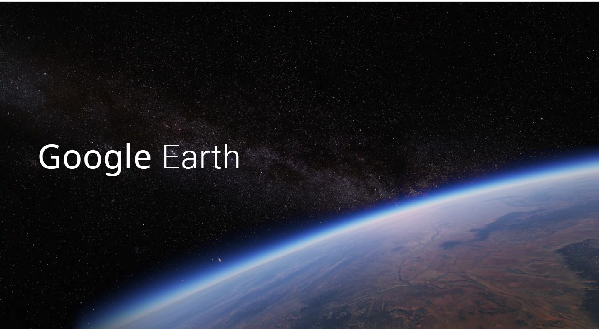
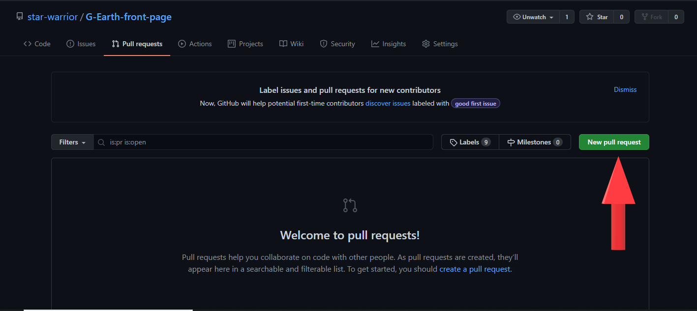

# Google Earth Loader Page

### Inspired From Google earth Website  

&nbsp;  

### Visit [Here](https://earth.google.com/web/) 

&nbsp;  

  
## Preview Of the Website
&nbsp;  

## Tasks to do.  

- Find Product Sans Font(Google Use it).
- Improve Design.
- Make the Loader.
- Responsiveness.

&nbsp;  

## Wanna Contibute Here.  

> If you want to contribute in this project , Thanks a lot .... Just Download This Project By typing `git clone https://github.com/star-warrior/G-Earth-front-page.git` in your Terminal or download it Manually And you're All set.  

## Whenever you have your improved project ready ,  make a pull request from my repository .... Its [here](https://github.com/star-warrior/G-Earth-front-page/pulls).  

  

&nbsp;  

> Image Credits to [Google Earth](https://earth.google.com/web/).  

&nbsp;  
&nbsp;  

# Note to the haters :- Only Images were claimed from the website , No other code was Copied :)